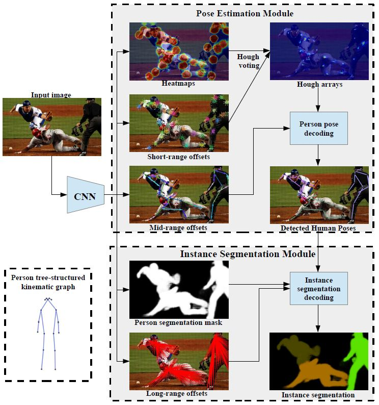
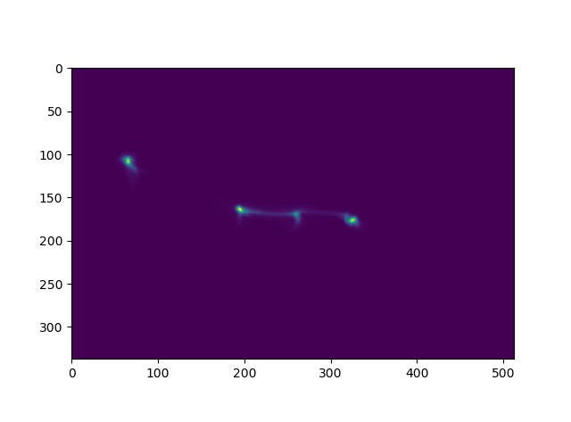
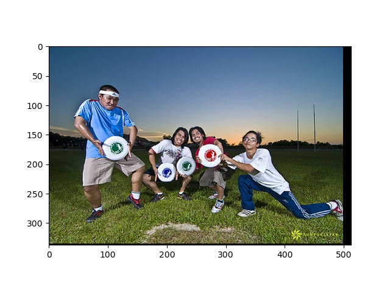
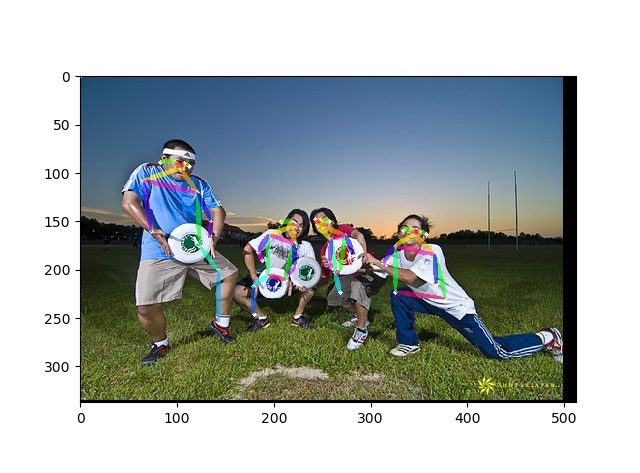
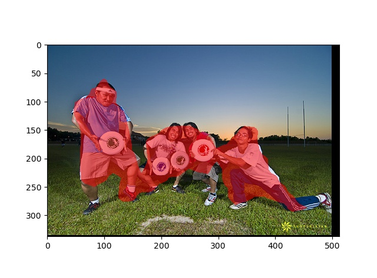
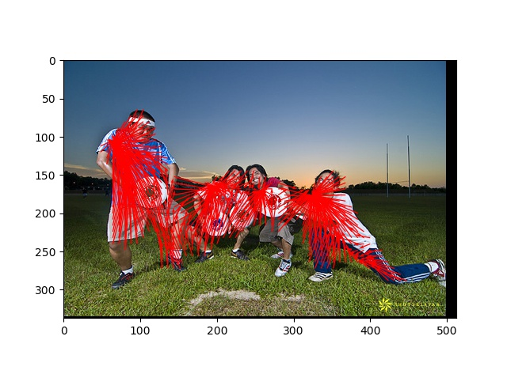

# PersonLab(ECCV2018) 
For codes, go straight to [**3) Implementation**](#3-implementation).

## 1) Introduction

This Bottom-up approach is an ECCV2018 paper named `Personlab: Person pose estimation and instance segmentation with a bottomup, part-based, geometric embedding model`. PersonLab is simple and hence fast, it outperforms some SOTAs in both keypoint localization and instance segmentation task on COCO. In particular, the pipeline of this algorithm includes six main stages (not in order):

1. Predict all keypoints of all persons in the image using fully convolutional network;
2. Also predict the relative displacement between each pair of keypoints with a novel recurrent scheme to improve long-range predictions;
3. Use a greedy decoding process to group keypoints into instances;
4. Predict instance segmentation masks for each person;
5. Also predict offset vectors to each of the K keypoints of the corresponding person instance for every person pixel;
6. Use an efficient association algorithm to do instance segmentation decoding.

Note: For working better in clutter, greedy decoding starts from the most confident detection keypoint instead of a definite landmark liking nose. Below is an overview of PersonLab method.



The PersonLab system consists of a CNN model that predicts: (1) keypoint heatmaps, (2) short-range offsets, (3) mid-range pairwise offsets, (4) person segmentation maps, and (5) long-range offsets. The first three predictions are used by the _Pose Estimation Module_ in order to detect human poses while the latter two, along with the human pose detections, are used by the _Instance Segmentation Module_ in order to predict person instance segmentation masks.

## 2) Impression & Understanding

PersonLab does both pose estimation and instance segmentation task in one system. We only focus on the effect of the former branch pose estimation. Here are some topics what I think are important after reading the paper.

1. **Hough Voting**: Aggregate the detected heatmap and short-range offsets into 2D Hough score maps.
2. **Bilinear Interpolation Kernel**: Compute Hough score using short-range offsets array.
3. **Recurrent Offset Refinement**: Refine the mid-range pairwise offsets using the more accurate short-range offsets. *pairwise displacements = mid-range pairwise offsets + short-range offsets.*
4. **Fast Greedy Decoding**: Group keypoints into detected person instances.
5. **Non-Maximum Suppression**: Use a NMS radius of *r = 10* pixels to reject redundant candidate points.
6. **Object Keypoint Similarity**: Evaluation metric OKS is used in the COCO keypoints task and penalizes localization errors for different keypoint types with different accuracy thresholds.

Focus on these points will help to facilitate the subsequent separation of pose estimation part.

## 3) Implementation

Unfortunately, authors did not provide the official implementation code. We have to do our best to reproduce the paper with the help of the work of good people and our own understanding. This code repo is mainly based on a third-party implementation [Keras-Tensorflow of PersonLab](https://github.com/octiapp/KerasPersonLab). It provides no pre-trained model and mAP on COCO2017 test-dev. And he also can't guarantee the correctness and effectiveness of his code, neither can we.

**NOTE:** Original PersonLab mathod does both *Person Pose Estimation* and *Person Instance Segmentation*. And paper has no mention of the benefits of doing both tasks at the same time. So we only care about *Pose Estimation* and separate it from network architecture.

### 3.1) Environment

This code was only tested in the following environment:
```
Lab Server: 225 (2 GTX 1080Ti)
Ubuntu 18.04
CUDA 10.1
Python 3.6
Tensorflow-gpu 1.12
Keras 2.2.4
OpenCV 3.4.3

Lab Server: 119 (3 Tesla K40c)
Ubuntu 18.04
CUDA 9.0
Python 2.7
Tensorflow-gpu 1.8.0
Keras 2.1.6
OpenCV 3.4.1
```

### 3.2) Training and Testing
- **Codes:** Download codes in your machine. You can ignore other unrelated parts and just pull `Pose_Estimation_Depository/PersonLab` as follows. **Do not use Windows PowerShell**, it doesn't support `parse-checkout`. Please use git bash or Linux.
  ```
  git clone -n https://github.com/hnuzhy/Pose_Estimation_Depository.git
  cd Pose_Estimation_Depository
  git config core.sparsecheckout true
  echo PersonLab >> .git/info/sparse-checkout
  git checkout master
  ```
  
- **Datasets:** Go [COCO](http://cocodataset.org/) to download [2017 Train images [118K/18GB]](http://images.cocodataset.org/zips/train2017.zip), [2017 Val images [5K/1GB]](http://images.cocodataset.org/zips/val2017.zip) and their GroundTrue [2017 Train/Val annotations [241MB]](http://images.cocodataset.org/annotations/annotations_trainval2017.zip). We use `train2017` to train our model and report mAP in `val2017`. Results on `test2017` need to use [COCO Online Evaluation Services](https://competitions.codalab.org/competitions/12061).

- **Pre-Processing:** Please use script [`./preprocessing/generate_hdf5.py`](./preprocessing/generate_hdf5.py) to transform images and annotations of keypoints and masks into HDF5 format that suitable for the `tfrecord API`. Doc [`./preprocessing/readme.md`](./preprocessing/readme.md) has explained the code and some tricks for encoding masks in COCO. And using the script to preprocess COCO_train2017 will get a 66G ensemble file.

- **Training:** You can change some configuration parameters that suit your training environment in [`./src/config.py`](./src/config.py). Among *TRAINING CONFIGS*, some key variables need to be modified flexibly, including *IMAGE_SHAPE, H5_DATASET, NUM_GPUS, BATCH_SIZE_PER_GPU, SAVE_MODEL_PATH, NUM_EPOCHS and INTER_SUPERVISION*. Note that the two states of *MODE* represent training original PersonLab or training only pose estimation. After that, run *train_personlab.py* script.

- **Testing:** By using the trained model, we can test its effectiveness and time-consuming. Testing script *test_personlab.py* can plot 
short-range offsets map, keypoints heatmap, short offsets, middle offsets and person poses. If MODE is 1 and it is full model, binary masks, long offsets and instance segmentation masks will also be showed. We only trained a semi-finished model of the whole algorithm. [full model](https://pan.baidu.com/s/1Poc-SoxpbWEI2nIRCkKXSg) password: **rvyj**. Although the model for pose estimation only converges, the detection effect is not good. [only pose](https://pan.baidu.com/s/1Sjir22yh5Wmt1k-ROal5qw) password: **xmrk** .

  In addition, the time of some key steps is also measured, although the use of GPU can speed up the detection part of the model, the time-consuming of post-processing of Group Skeletons is still unbearable. Attempts to move certain operations to the GPU will not change this situation. All these seriously affect the real-time performance of PersonLab algorithm in our application.

### 3.3) Results

We only chose to use full model to detect a demo picture. These results indicate that the model is far from satisfactory. And there is still much room for improvement in the reproduced algorithm.

**Pose Estimation Part:**

Output_Map: Rshoulder


Heatmaps: Rshoulder



visualize_short_offsets: Rshoulder


visualize_mid_offsets_1: Rshoulder --> Rhip


visualize_mid_offsets_2: Rhip --> Rshoulder



plot_poses



**Instance Segmentation Part:**

Binary_Mask



visualize_long_offsets



plot_instance_masks


### 3.4) Other Implementations

[Keras Version]
[[octiapp/KerasPersonLab]](https://github.com/octiapp/KerasPersonLab)

[TensorFlow Version]
[[scnuhealthy/Tensorflow_PersonLab]](https://github.com/scnuhealthy/Tensorflow_PersonLab)
[[sydsim/personlab-tf]](https://github.com/sydsim/personlab-tf)

### 3.5) Citation

```
@article{Papandreou2018PersonLab,
  title={PersonLab: Person Pose Estimation and Instance Segmentation with a Bottom-Up, Part-Based, Geometric Embedding Model},
  author={Papandreou, George and Zhu, Tyler and Chen, Liang Chieh and Gidaris, Spyros and Tompson, Jonathan and Murphy, Kevin},
  booktitle={European Conference on Computer Vision (ECCV)},
  year={2018},
}
```

